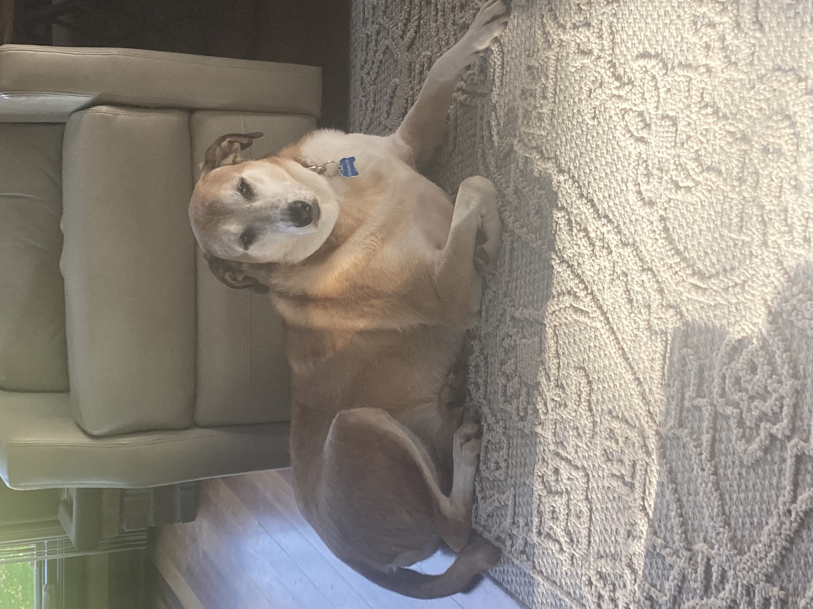

<!--
**MattV15/MattV15** is a ✨ _special_ ✨ repository because its `README.md` (this file) appears on your GitHub profile.

Here are some ideas to get you started:

- 🔭 I’m currently working on ...
- 🌱 I’m currently learning ...
- 👯 I’m looking to collaborate on ...
- 🤔 I’m looking for help with ...
- 💬 Ask me about ...
- 📫 How to reach me: ...
- 😄 Pronouns: ...
- ⚡ Fun fact: ...
-->
# Hello! I'm Matt Van Duyn, a junior transfer student majoring in Information Sciences!    
 

  
   
  <em></em>

I am currently interested in HCI and exploring classes and concepts related to that. 

I have some Python experience.

I graduated from College of DuPage in 2024 and transferred to University of Illinois Urbana-Champaign, which I now attend.

⚡A fun fact about me is I have a _very_ cute dog!  

  
   
  <em></em>

I also enjoy video games and reading. 

📫How to reach me: mattvanduyn04@gmail.com  

📫Check out my LinkedIn: https://www.linkedin.com/in/matthew-van-duyn/ 

The project I have most recently worked on was a hypothetical open-source project involving the implementation of a volunteer portal for a hypothetical food pantry: Kindness Place Food Pantry. 

😄I will continue exploring and figuring everything out!
